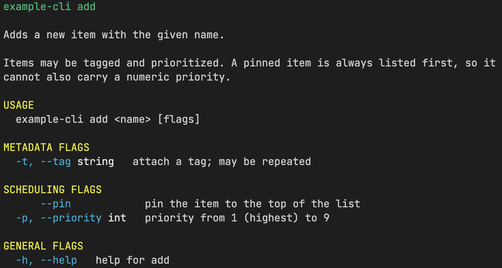

# `go-cli`

<!-- markdownlint-disable MD033 -->

[![GoDoc][go-doc-badge]][go-doc-link]
[![License][license-badge]][license-link]
[![Release][release-badge]][release-link]

[![Issues][issue-badge]][issue-link]
[![Continuous Integration][ci-badge]][ci-link]

<!-- markdownlint-enable MD033 -->

This library is an **opinionated** framework built around the [cobra] and [pflag]
libraries to provide a simple and easy way to build **testable** command-line
applications.

[cobra]: https://github.com/spf13/cobra
[pflag]: https://github.com/spf13/pflag
[ci-badge]: https://github.com/bitwizeshift/go-cli/actions/workflows/continuous-integration.yaml/badge.svg
[ci-link]: https://github.com/bitwizeshift/go-cli/actions/workflows/continuous-integration.yaml
[go-doc-badge]: https://godoc.org/github.com/bitwizeshift/go-cli?status.svg
[go-doc-link]: https://godoc.org/github.com/bitwizeshift/go-cli
[license-badge]: https://img.shields.io/badge/license-MIT%20or%20Apache--2-blue.svg
[license-link]: https://raw.githubusercontent.com/bitwizeshift/go-cli/master/LICENSE-MIT
[issue-badge]: https://img.shields.io/github/issues/bitwizeshift/go-cli.svg
[issue-link]: https://github.com/bitwizeshift/go-cli/issues
[release-badge]: https://img.shields.io/github/release/bitwizeshift/go-cli.svg?include_prereleases
[release-link]:https://github.com/bitwizeshift/go-cli/releases/latest

## Quick Links

* [🏆 Teaser Demo](#teaser)
* [💼 Features](#features)
* [🚀 Examples](./examples)
* [📚 Documentation](./docs)
* [🤨 Why `go-cli`?](#why-go-cli)

## Teaser

<!-- markdownlint-disable MD033 -->

<!-- markdownlint-enable MD033 -->

## Features

* 🚦 **Highly testable surface-area**: Your flags become testable factories that
  implement [`arg.Registrar`] and return high-level objects, and your commands
  become a simple [`cli.Runner`] that can use dependency-injected factories.

* 📄 **Configurable commands using YAML**: No more overlong inline `string`s for
  `Short` or `Long`; write it in a `.yaml` file so that it's easy to read and
  maintain.

* 💻 **Automatic text resizing in terminals**: `--help` messages will
  automatically size-to-fit terminals of different sizes so that output remains
  readable and well-structured.

* ⏩ **Simplified flag surface area**: No more dozens of `pflag.FlagSet` values;
  just use [`arg.AddFlag`], and it idiomatically uses Go to understand
  either [`encoding.TextUnmarshaler`] or custom [`arg.Unmarshaler`].

* 🛟 **Support for flag fallback defaults**: Flags can now support falling back
  to either environment variables, or custom functions to derive a default value.

* 📦 **Support for grouping flags**: A highly-requested but absent feature of
  both [`cobra`] and [`pflag`], available at last.

* 💄 **Visually clear defaults**: This puts a fresh coat of paint on the default
  CLI experience of Cobra out of the box by leveraging conditional colours.

* 🎨 **Configurable colours**: The CLI supports custom BBCode-inspired markup
  for dynamic themes/colouring of text. You can write `[fg:red]hello[/fg]` to
  stdout, and it will color the text red as long as you're in a terminal.

Overall, this library sacrifices Cobra's verbosity and flexibility for some
opinionated and visually clear defaults.

[`encoding.TextUnmarshaler`]: https://pkg.go.dev/encoding@go1.26.4#TextUnmarshaler
[`arg.Unmarshaler`]: https://pkg.go.dev/github.com/bitwizeshift/go-cli/arg#Unmarshaler
[`arg.Registrar`]: https://pkg.go.dev/github.com/bitwizeshift/go-cli/arg#Registrar
[`arg.AddFlag`]: https://pkg.go.dev/github.com/bitwizeshift/go-cli/arg#Add
[`cli.Runner`]: https://pkg.go.dev/github.com/bitwizeshift/go-cli#Runner

## Why `go-cli`?

Both [`cobra`] and [`pflag`] are libraries that _get the job done_, but are not
particularly well-suited towards building testable or high-quality/scalable
abstractions.

There are a number of sharp-edges that this library tackles:

* The [`cobra.Command`] and [`pflag.FlagSet`] split a number of responsibilities
  between them -- which makes it difficult to write code following best
  practices like [Single-Responsibility-Principle][srp].

  For example, flag names are dictated by the flag definitions, but
  _flag completion_, _flag constraints_ (requires, mutually exclusive, etc.) are
  all part of the `cobra.Command` object.
  This leads code to need to "know" about both the flag its registering to, as
  well as the command it will be used with -- which is tight coupling.

  _This library ensures flags only deal with flags, nothing more._

* The [`pflag.Value`] abstraction is a poor abstraction when it comes to
  testability since it logically expects `Type() string` to be pinned to a
  single value. Testing this in code inherently causes tight coupling between
  the test and the Value implementation, since there is no logic to truly
  validate.

  _This library makes `Type` an option on flag creation, with the default coming
  from reflection._

* There is no mechanism for grouping flags in any way, it always needs to be
  hand-rolled. This hand-rolling requires modifications to the [`cobra.Command`]
  object's templates so that it can properly render the grouping.

  _This library leverages flag annotations and custom, pre-built templates to
  achieve automatic grouping that only the flags have to know about._

* [`pflag.FlagSet`] offers entirely too many receivers for setting up flags.

  _This library reduces cognitive overhead by having a single monolithic flag
  entrypoint which leverages idiomatic unmarshaling patterns instead._

* etc. The list goes on and on.

The primary motivation is tackling these sharp edges, while improving ergonomics,
at the deliberate sacrifice of unnecessary complexity and an overwhelming number
of combinations that most users should never need to experience.

[srp]: https://en.wikipedia.org/wiki/Single-responsibility_principle
[`cobra.Command`]: https://pkg.go.dev/github.com/spf13/cobra#Command
[`pflag.FlagSet`]: https://pkg.go.dev/github.com/spf13/pflag#FlagSet
[`pflag.Value`]: https://pkg.go.dev/github.com/spf13/pflag#Value

## Disclaimer

I wrote this library for me, to satisfy my own personal needs -- and am sharing
this out in case anyone else finds value in it. I make my own opinionated
defaults that others may not agree with; and that's _fine_.
